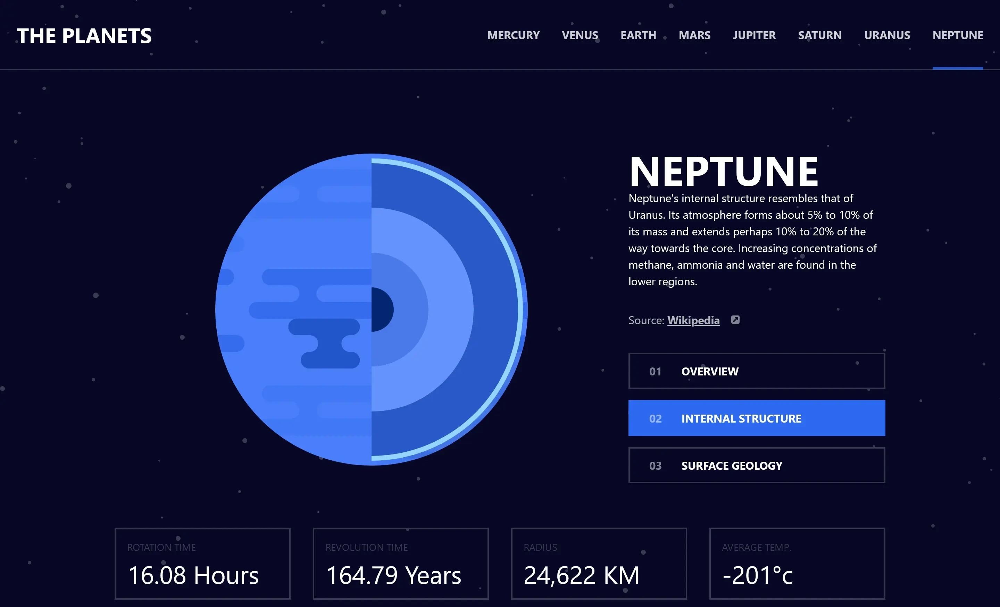

# Planets facts

  

Interactive site showing several characteristics of the planets in our solar system. You can see

- the planet's general characteristics
- characteristics of the planet's strata
- characteristics of the planet's geological surface
- the planet's physical characteristics

    

| the planet's strata                    | the planet's geological surface       |
| -------------------------------------- | ------------------------------------- |
|  |  |

## User stories

- [x] View each planet page and toggle between the "Overview", "Internal Structure", and "Surface Geology" tabs
- [x] View the optimal layout for the app depending on their device's screen size
- [x] See hover states for all interactive elements on the page

## Built with

- Semantic HTML5 markup
- Mobile-first workflow
- TailwindCSS
- Typescript
- AstroJS
- React

## Author

- Website - [Portfolio](https://calcagno-loic.netlify.app/)
- Frontend Mentor - [@CalcagnoLoic](https://www.frontendmentor.io/profile/CalcagnoLoic)
